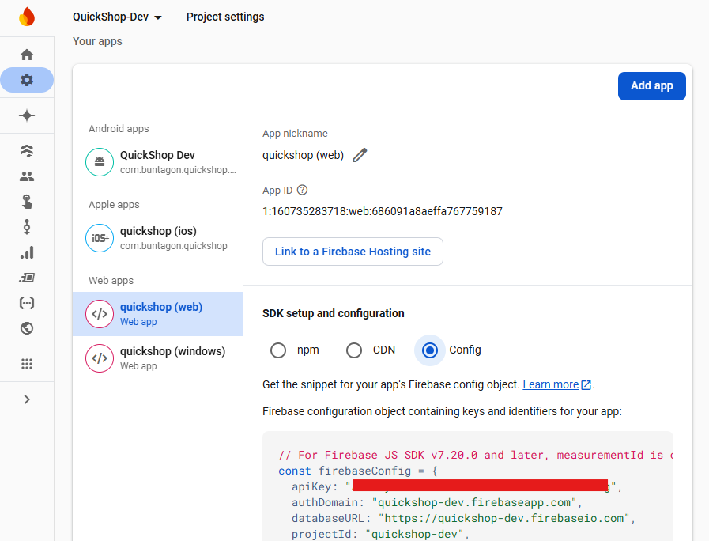

# Quickshop 3 Firebase Configuration

This project hosts the configuration deployed to Firebase for the Quickshop 3 project.

## Prerequesites
- [NodeJS](https://nodejs.org/en) 22.11.0 or greater
- [Firebase CLI](https://firebaseopensource.com/projects/firebase/firebase-tools/) 13.24.2 or greater

## Utility App 
The utility app is a Next.js application that handles sharing links for users that do not already have Quickshop installed. The app is built as a [static SPA](https://nextjs.org/docs/pages/building-your-application/deploying#static-html-export) with no server-side logic, and hosted in Firebase Hosting. 

### App Distribution Invite Links
The utility app uses [invite links for Firebase App Distribution](https://firebase.google.com/docs/app-distribution/create-invite-links?platform=android) to make it easy for users to sign themselves up as a tester in Firebase App Distribution. 

Invite links for each target environment are stored in environment files at: `/quickshop-utility-app/.env.<ENVIRONMENT_NAME>`

### Develop and Deploy
To run locally
1. Copy and rename either of `.env.dev` or `.env.prod` to `.env`
2. From `quickshop-utility-app` folder run `npm run dev`

To deploy to dev via command line
1. In `quickshop-utility-app` folder, rename `.env.dev` to `.env`
2. From `quickshop-utility-app` folder run `npm run build`. This will build a static web app version of the NextJS app, outputting to `quickshop-utility-app\out`
3. Copy and rename `app-links/assetlinks-dev.json` to `quickshop-utility-app/out/.well-known/assetlinks.json`. The `.well-known` folder will need to be created.
4. From root folder run `firebase deploy --only hosting`. This will deploy the built assets to the default Firebase project, `quickshop-dev`, as specified in the `.firebaserc` file

To deploy to prod via command line
1. Copy and rename `.env.prod` to `.env`
2. From `quickshop-utility-app` folder run `npm run build`. This will build a static web app version of the NextJS app, outputting to `quickshop-utility-app\out`
3. Copy and rename `app-links/assetlinks-prod.json` to `quickshop-utility-app/out/.well-known/assetlinks.json`. The `.well-known` folder will need to be created.
4. From root folder run `firebase deploy --project quickshop-prod --only hosting`. This will deploy the built assets to the `quickshop-prod` Firebase project

### App Links Configuration - Android
Android apps can be configured to automatically handle `https` URLs instead of the link being opened in a browser. The complete steps required to enable this behaviour for a flutter app are described here: https://docs.flutter.dev/cookbook/navigation/set-up-app-links

In this repository, the `/app-links` folder contains verions of the `assetslinks.json` file for each deployment environment. In the CI deployment pipelines, the corresponding file for the environment is copied into the built output folder at `/quickshop-utility-app/out/.well-known/assetlinks.json`. This file is deployed to firebase hosting along with the utility app. For example, in prod, this file is publically available at `https://quickshop.buntagon.com/.well-known/assetlinks.json`

When a link to the Quickshop domain name is opened on a user's device, and when the Quickshop app is already installed with its Android manifest declaring that it can handle https links to that hostname, then the Android OS automatically loads this `assetlinks.json` file to verify if the app should be allowed to automatically handle the link instead of opening it in the browser. 

### App Links Configuration - Sharing Links via Facebook products 
Our delightful friends at Facebook & Co have *helpfully* (sarcasm strongly intended) created their own standards for deep linking into mobile apps. Instead of just supporting what the Android and iOS operating systems do natively, if you open a HTTP deep link from Facebook or from Facebook Messenger (and probably also instagram), instead of deep-linking into the app it will open the link as a webpage in an embedded browser instead.

It is possible to register your app with Facebook so that deep links work as they should when opening them from Facebook products; see the documentation here: https://developers.facebook.com/docs/applinks/overview. However, this requires further configuration to be added to the utility app webpage, and the installation of a facebook plugin in the mobile app, all just to handle behaviour which the operating system already provides. Personally, the improvement in user experience is not worth giving Meta the satisfaction of succumbing to their walled garden. 

The workaround implemented in the utility app is to display a button which can open the app using an [Android deep link](https://developer.android.com/training/app-links#deep-links) with a custom scheme rather than the https scheme. Of course, Facebook can't resist getting in one last parting shot. It shows a dialogue message that tries to make everything outside the "Metaverse" sound scary and untrustworthy: "The website you're viewing is attemping to open an external app. Would you like to continue?" Hilarious. 

## Firestore Configuration
Configuration for the Firestore NoSQL databases used by Quickshop are stored in the following files:
1. `firestore.rules` Declares security rules which control user access to firestore documents. [Firestore security rules documentation](https://firebase.google.com/docs/firestore/security/get-started)
2. `firestore.indexes.json` Declares indexes on document fields required to support complex queries. [Firestore indexes documentation](https://firebase.google.com/docs/firestore/query-data/indexing)

To deploy via command line:
1. Run `firebase deploy --project <PROJECT_NAME> -- only firestore`

## Firebase Functions

### Development Debugging
1. Start typescript compiler running. This will watch for changes to typescript files in `/functions/src` and compile them to javascript files output in `/functions/lib`
    - `cd functions`
    - `npm run build:watch`
2. In a new terminal in the repository root directory, start firebase functions emulator running to host the functions. The `--inspect-functions` argument exposes a debug port for the function execution
    - `firebase emulators:start --only functions --inspect-functions`
3. Start a debug session in Visual Studio Code using the `Debug` launch configuration in the `Run and Debug` window. The configuration in `launch.json` will attach to the debug port exposed by the functions emulator, and breakpoints in the typescript files in `/functions/src` will be hit and the code can be stepped through and inspected. 
4. After editing any typescript files and saving:
    - Typescript files will be automatically recompiled to javascript
    - The emulator will automatically detect the updated javascript files and host them
    - The debug session in VSCode will be terminated and need to be restarted

### Invoking HTTP Functions with Postman
HTTP triggered functions are secured using Firebase Authentication, ensuring that only users of Quickshop registered in Firebase Authentication are able to invoke the functions. Authentication is performed using a bearer token in the `Authorization` header of incoming requests. The header value must be of format `Bearer <TOKEN>`, where `<TOKEN>` is a Google Identity Platform ID token, which can be obtained using the [`signInWithPassword` REST API](https://cloud.google.com/identity-platform/docs/use-rest-api#section-sign-in-email-password)

To simplify the process of obtaining and using an id token, the `/postman` folder in this repo contains a postman collection that is configured automatically obtain and use id tokens when calling Quickshop HTTP triggered functions. 

To invoke HTTP triggered functions running on the local emulator:
1. Import `Quickshop.postman_collection.json` into Postman. This contains definitions of available HTTP requests 
2. Import `Local.postman_environment.json` into Postman. This contains definitions of environment variables required to complete the requests 
3. In Postman, open the imported 'Local' environment. Enter values in the current values column for the `auth.*` variables:
    - `auth.email` and `auth.password`: The email address and password of a user registered in Firebase Authentication
    - `auth.api_key`: The API key of a web application registered in the target firebase project

4. Invoke a request from the postman collection. The Pre-request script at the collection level will check to see if an ID token is available, and if it is valid (they typically have a 1 hour expiry time). If not, a new token will be fetched using the supplied email and password, and the token will be added in the Authorization header. 

### Deploying Manually
1. `npm --prefix ./functions run lint`: Run eslint to check for lint errors
2. `npm --prefix ./functions run build`: Compile the typescript source files into javascript
3. `firebase deploy --only functions --project=<PROJECT>`: Deploy the functions

Note, the first deployment of functions to a Firebase project may fail with an internal error, with output like this:
```
i  functions: creating Node.js 18 (2nd Gen) function acceptListInvite(us-central1)...
Build failed with status: INTERNAL_ERROR and message: An unexpected error occurred. Refer to build logs:
```
Re-running the manual deployment seems to resolve the problem, so it may just be an issue with APIs being activated or role assignments being propagated that needs to happen as part of the first-time deployment. 

### Deleting Build Artifacts After Deployment
There is an issue with deploying Firebase Functions via the Firebase CLI, where the intermediate artifacts generated by the deployment are not tidied up afterwards, and thus could incurr some billing cost over time. See this [Github issue](https://github.com/firebase/firebase-tools/issues/4757). As of 18/11/24 the workarounds and fixes suggested in the issue comments have not been found to be effective in preventing the problem. In pipeline deployments, the pipeline includes a step to delete the build artifacts.

After manual deployment, the artifacts should be deleted to avoid this cost. 
1. Open Artifact Registry: https://console.cloud.google.com/artifacts
2. Use the dropdown in the top left to select the relevant Firebase project
3. Select the `gcf-artifacts` item in the repositories list and delete it

## CI / CD Pipelines
The following environment variables are set in each environment in the Github Repo under Settings > Environments:
- `FB_HOSTING_CREDENTIALS`: A google cloud service account JSON key granting permission to push app builds to firebase hosting. [See steps detailed here](https://github.com/FirebaseExtended/action-hosting-deploy/blob/main/docs/service-account.md) for creating a service account with appropriate roles. All newlines should be removed from the json key file before adding it as a secret in github actions
- `FB_FUNCTIONS_CREDENTIALS`: A google cloud service account JSON key granting permissions to deploy to Firebase Functions. It should be assigned the roles `Cloud Functions Admin`, `Service Account User`, `Firebase Viewer`, `Artifact Registry Administrator`
- `FB_FIRESTORE_CREDENTIALS`: A google cloud service account JSON key with permission to configure Firestore. See next section for details

### Firestore Service Account Requirements
In Google Cloud identity and access management (IAM), access to services and APIs are controlled through *permissions*. Users and service accounts are not assigned permissions directly, but instead they are assigned *roles*. A role includes a collection of permissions all granted through that role.  

The service account used to deploy configuration to firestore requires [permissions to manage Firestore security rules](https://firebase.google.com/docs/projects/iam/permissions#security-rules). There are no [pre-defined firebase roles](https://firebase.google.com/docs/projects/iam/roles-predefined-product#firestore) that includes these permissions, apart from firebase project owner role - which would violate the principal of least-access if it was assigned to a service account. Therefore, we need to create a custom role with permissions to deploy rules.

See [Google cloud documentation on creating a custom role](https://cloud.google.com/iam/docs/creating-custom-roles?cloudshell=true#creating)
1. Open the roles list for the project: https://console.cloud.google.com/iam-admin/roles
2. Select `CREATE ROLE`
3. Give a title like `Firebase Rules Owner` and a role id like `firebaserules.owner`
4. Give a description like `Full access to create and manage Firebase security rules for Firestore and Cloud Storage`
4. Set the role launch stage to `General Availability`
5. Select `ADD PERMISSIONS`
6. Enter `firebaserules` in the `Filter: Enter property name or value` field. Don't use the `Filter permissions by role` dropdown
7. Select all permissions. **There may be multiple pages** of permissions - make sure to go through all the pages and select all the `firebaserules` permissions 
8. Create the role

When creating the service account for firestore deployment, the following roles should be assigned:
    - `Cloud Datastore Owner`
    - `Firebase Viewer`
    - `<RULES_OWNER_ROLE_NAME_FROM_ABOVE>`

The roles assigned to each user and service account in a project can be viewed and managed here: https://console.cloud.google.com/iam-admin/iam


### Google Cloud Config Requirements
The following APIs must be enabled in each Google Cloud project in order for the pipelines to execute successfully:
- [Firebase Hosting API](https://console.cloud.google.com/apis/library/firebasehosting.googleapis.com) used by CI pipelines to deploy to Firebase Hosting via API call
- [Cloud Resource Manager API](https://console.cloud.google.com/apis/library/cloudresourcemanager.googleapis.com) used by CI pipelines to verify that service accounts have the necessary permissions for deployment
- [Cloud Billing API](https://console.cloud.google.com/apis/library/cloudbilling.googleapis.com) used by CI pipelines in Firebase Functions deployment. I don't know why. 
- [Firebase Extensions API](https://console.cloud.google.com/apis/library/firebaseextensions.googleapis.com) used in Firebase functions deployment
- [Cloud Run Admin API](https://console.cloud.google.com/apis/library/run.googleapis.com) used in Firebase functions deployment
- [Eventarc API](https://console.cloud.google.com/apis/library/eventarc.googleapis.com) used in Firebase functions deployment
- [Cloud Storage API](https://console.cloud.google.com/apis/library/storage.googleapis.com) used in Firebase functions deployment

In addition, roles must be granted to some of the service accounts which are automatically created for each firebase project. For new projects, these roles may already be assigned automatically when the account is created. The list of roles can be managed via the [project IAM dashboard](https://console.cloud.google.com/iam-admin/iam).

The Cloud Pub/Sub Service Account allows pub/sub (used to trigger Firebase functions) to interact with the rest of the project. It has an email address of format `service-<PROJECT_NUMBER>@gcp-sa-pubsub.iam.gserviceaccount.com`. It can be viewed in the IAM dashboard by selecting the "Include Google-provided role grants" checkbox on the right of the page above the permissions table. Required roles:
- Service Account Token Creator

The default compute service account is named as `<PROJECT_NUMBER>-compute@developer.gserviceaccount.com`. This account is automatically created when enabling Firebase Functions, and is used to execute the functions. Required roles:
- Editor 
- Cloud Run Invoker 
- Eventarc Event Receiver 

### Functions Predeploy Step Error
The `firebase.json` file generated by the Firebase CLI when initialising firebase functions in a project includes a `predeploy` section that lints then builds the project before deployment using `npm run lint` and `npm run build`. However when executing the deployment on a Github Actions CI server, execution of the predeploy steps resulted in the following error, [also mentioned on stackoverflow](https://stackoverflow.com/questions/77504522/firebase-deploy-error-running-command-npm-prefix-resource-dir-run-lint-r).

```
=== Deploying to 'quickshop-dev'...

i  deploying functions 
Running command: npm --prefix ./functions run build

> build
> tsc

/bin/sh: 0: Illegal option --
```

This error `Illegal option --` error does not seem related to the actual build itself, as the `npm run build` command can be successfully executed in a standalone github actions step.  

The github actions CI server was using Node v22.11.0 and Firebase CLI 13.25.0. Using the exact same node and firebase CLI versions, I was able to successfully deploy firebase functions from a Windows 11 machine. To workaround this issue in the CI pipeline execution, all steps were removed from the `predeploy` section of `firebase.json`, and the CI build pipeline instead includes separate steps to lint and build the functions before deployment. 


## ARCHIVED - Firebase Functions with Python
This repository was originally configured to use Python to define Firebase Functions. However there is not built-in support for debugging Firebase Functions running in Python. See https://github.com/firebase/firebase-tools/issues/6838. To avoid the need for hacky workarounds, the functions were converted to NodeJS typescript functions. This section is only for reference regarding the setup required to develop Python functions. 

### Development Setup
1. Verify system python installation:
    - `python --version`: 3.11.9
    - `pip --version`: 24.0
2. Open a terminal in the `/functions` folder of this repository
3. Create `venv` environment
    - `python -m venv venv`
    - This uses the `venv` command to create a virtual environment, which we have chosen to also name `venv`
    - The virtual environment is created in a folder matching its name, i.e. `functions/venv`
4. Activate the environment using a script in `functions/venv/Scripts`
    - On windows, run `.\venv\Scripts\activate.ps1`
    - This will activate the python virtual environment in your current terminal session.
5. Install dependencies 
    - `pip install -r .\requirements.txt`
    - Direct dependencies listed in `requirements.txt` as well as indirect dependencies will be installed in the venv folder: `functions/venv/Lib/site-packages` 
6. Open a python file in `/functions`, and select the python interpreter as `/functions/venv/Scripts/python`. All IDEs that support Python should detect this as a virtual environment and display the environment name (i.e. also `venv` in this case) 

### Development Debugging
1. Start the Firebase emulator suite running: `firebase emulators:start`
2. Check the table in the output for the link to the Emulator UI 
    - `http://127.0.0.1:4000/functions` for example
    - Opening this page will display the log outputs from the functions exectuion
3. Check the log output for lines like the following to get the paths to use for calling http-triggered functions locally:
    - `http function initialized (http://127.0.0.1:5001/quickshop-dev/us-central1/FUNCTION_NAME)`
4. Invoke http triggered functions using tools like curl or postman
    - `curl http://127.0.0.1:5001/quickshop-dev/us-central1/FUNCTION_NAME?param=foobar` for example
5. Editing the python code in function definitions will automatically hot reload the emulator with the new function definitions

### Initial Setup
These steps were followed to perform initial setup of Firebase functions, as described [here](https://firebase.google.com/docs/functions/get-started?gen=2nd). These steps do not need to be repeated to continue developing the functions.
1. Verify system python installation is available on path:
    - `python --version`: 3.11.9
    - `pip --version`: 24.0
2. Set dev project as default `firebase use quickshop-dev` 
3. Initialise functions `firebase init functions`
4. Select Python as the language for cloud functions. A `functions` folder was created containing:
    - `main.py`: Example firebase functions written in python
    - `requirements.txt`: List of python package dependencies for pip installer
5. Answer `No` to 'Install dependencies now?', because of [this issue with initialising python functions](https://stackoverflow.com/questions/76450609/firebase-functions-gen2-python-init-does-not-work)
6. Add the `venv` folder as ignored in `/functions/.gitignore`. Not sure why this wasn't ignored by default. 
7. Follow the Development Setup steps above to prepare the venv environment for development